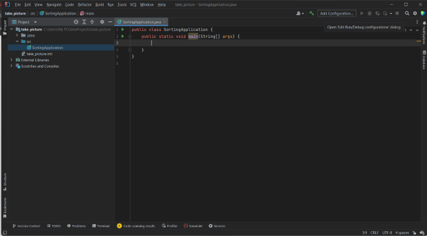
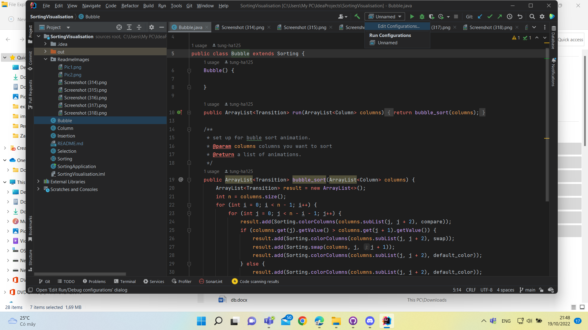
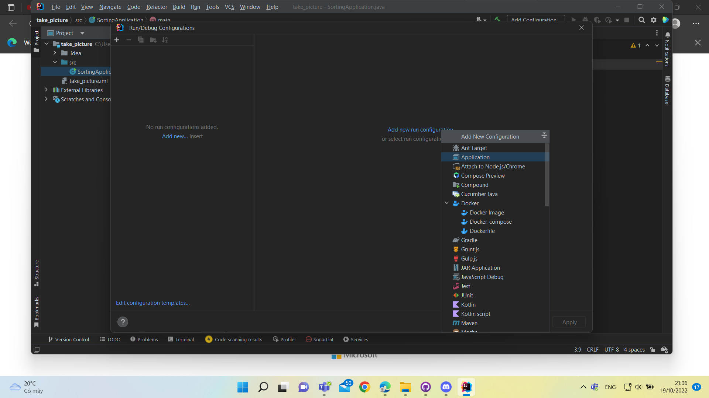
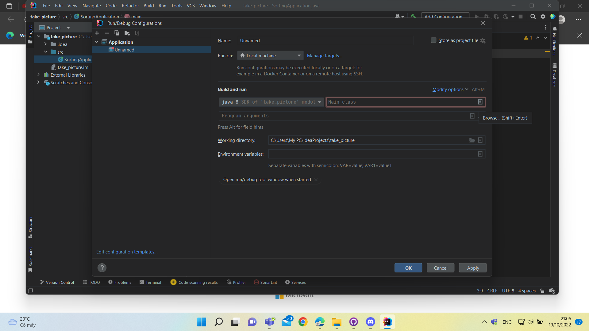
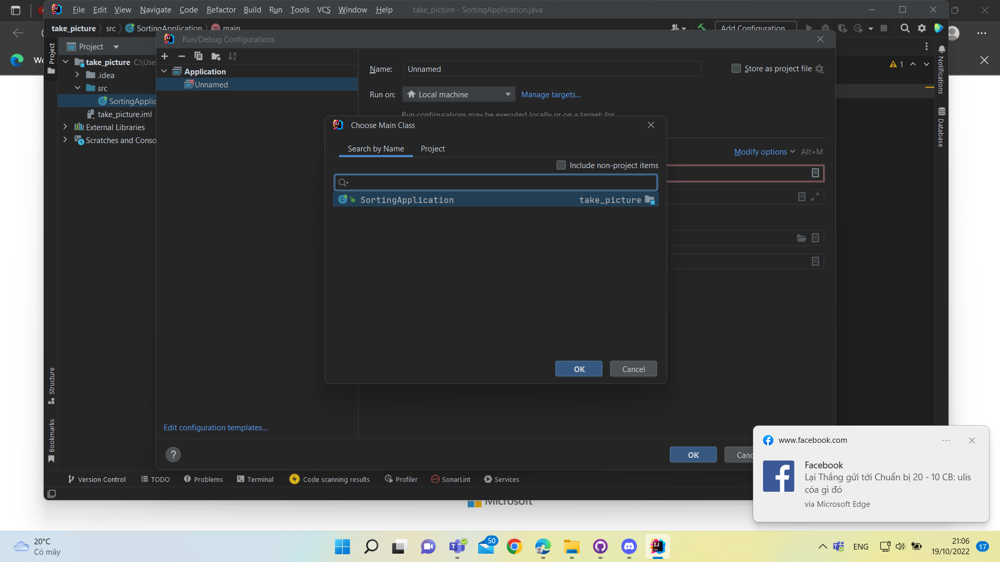
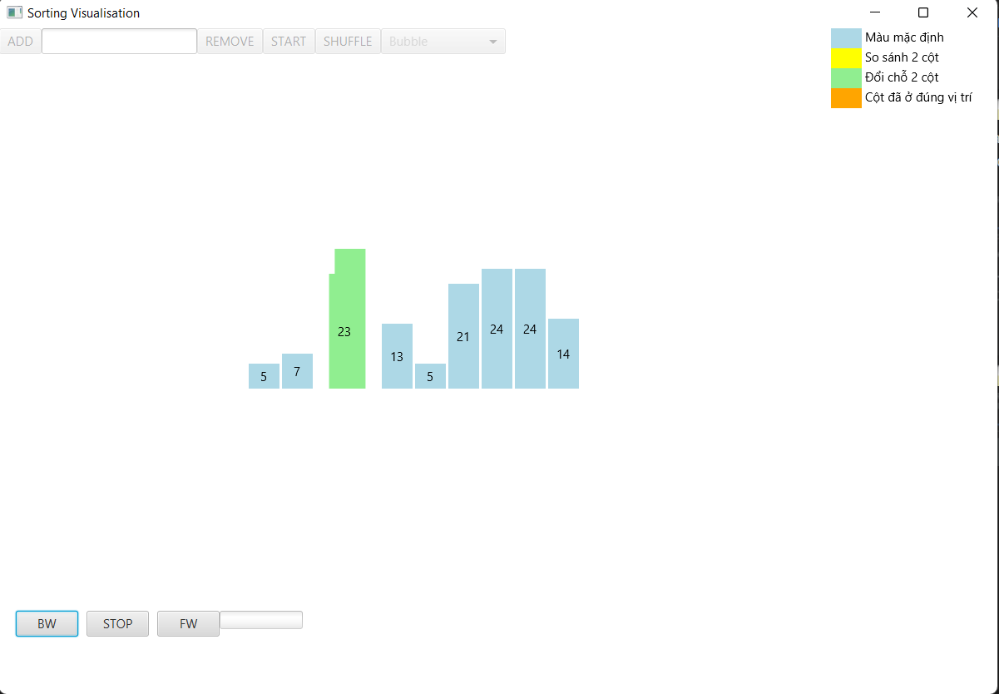

# Sorting Project
```
Hà Sơn Tùng - 21020398
Bài tập minh họa các thuật toán sắp xếp nổi bọt, lựa chọn, chèn
```

## *Cài đặt*
1. Tải file zip về máy
2. Giải nén file zip và lưu vào thư mục mà bạn chọn trên máy tính
3. Mở project (Vì project được viết trên IntelliJ nên dùng IntelliJ là tốt nhất)
4. Ấn vào nút 'Unamed' bên cạnh hình cái búa bên phải màn hình

5. Ấn vào Edit Configurations

6. Tạo 1 trang configuration mới với option là 'Application'

7. Bên phía dưới dòng Build and Run, click vào icon ở ô thứ 2 bên phải và chọn SortingApplication 
là file chứa hàm main


8. Nhấn OK, sau đó lại nhấn Apply và OK
Xong

## *Hình ảnh minh họa*
